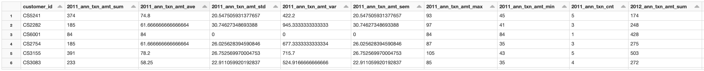

# Predicting-Customer-Responses-to-Promotional-Campaigns

The goal of this project is to predict how customers will respond (0 for negative response and 1 for positive response) to promotional campaigns. The project is divided into two primary stages:

1.	Feature engineering
2.	Model development and testing

Note: This project was implemented using PySpark.

## Stage 1: Feature engineering

The purpose of feature engineering is to create new relevant features from existing data that can be used to improve the performance of machine learning models. In this case, various features were created using a simple transaction dataset that only contains customer ID, transaction date, and transaction amount. These features will later be used as the input variable for 3 different machine learning models: Logistic Regression, Decision Tree, and Random Forest Classifier. 

Two new datasets were created from the original dataset. The first dataset captures customers' yearly spending, while the second dataset captures their monthly spending. The features calculated for yearly spending include customer spending sum, mean, standard deviation, variance, maximum, minimum, and count. All of these new features were then pivoted to arrange each year alongside the new features as the columns of the DataFrame. This pivot was performed to ensure that the model could be easily trained on the dataset. Please refer to the picture below for the final DataFrame:

Similar features were also generated for the DataFrame that records customers' monthly spending, with the inclusion of 3, 6, and 12-month rolling windows that capture each of the new features generated. Please refer to the picture below for the final monthly customer spending DataFrame:

[Insert Image]

## Stage 2: Model development and testing

Once the feature engineering stage was completed, I proceeded to analyze the classification problem using two separate datasets (annual and monthly) and three different algorithms, as depicted in the image below.
To train the machine learning models, the data was first divided into training and testing sets using the train-test split method. The training set was used to train the model, while the testing set was utilized to evaluate the model's performance on new, unseen data.

Next, hyperparameter tuning was performed to find the best combination of hyperparameters for each model. This involved testing various hyperparameters for each algorithm to determine the optimal settings that would produce the best results.

Once the hyperparameters were optimized, the models were trained on the training data, and their performance was evaluated using the precision-recall metric. Precision is the ratio of true positives to the sum of true positives and false positives, while recall is the ratio of true positives to the sum of true positives and false negatives. 

Overall, this process of training the model, hyperparameter tuning, and evaluating the model using precision-recall was repeated for each algorithm and dataset to obtain the best-performing model for predicting customer responses to promotional campaigns.
